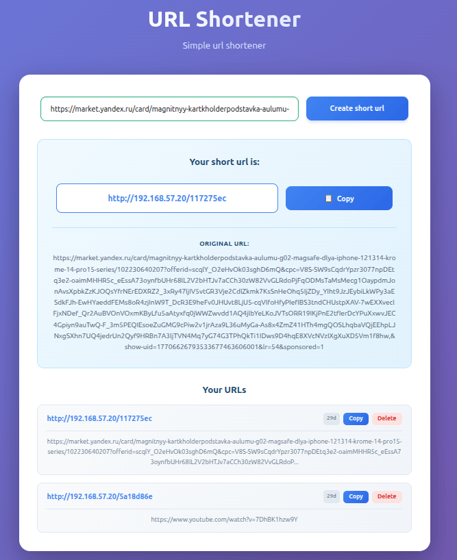

# URL Shortener with k3s

[](https://github.com/ArtemBorodinEvgenyevich/urlsshortener_with_k3s/actions/workflows/build_and_push.yml)

---
### Тестовый (моно) репозиторий для тренировки развертывания pet проектов в production-like среде.

> Work in progress

В данном примере используется "игрушечный" проект URL Shortener для сокращения ссылок.

Проект состоит из нескольких сервисов:
1. URLSFrontend - фронтенд (React+Vite)
2. URLSService - основная логика приложения (golang)
3. urls_iam_service - логика авторизации и создания анонимных сессий (golang + UberFX)

---

### Для развертывания используются:
* VirtualBox VMs (control node, dbs node - ubuntu server 22.04)
* Kubernetes (k3s)
* Prometheus
* Grafana
* ArgoCD
* Github Actions
---

### Архитектура

```
┌──────────────────────────────────────────────────┐
│  VM1 (192.168.57.20) — k3s server               │
│  ┌────────────┐ ┌────────────┐ ┌──────────────┐ │
│  │URLSService │ │IAM Service │ │  Frontend    │ │
│  │  :9091     │ │  :9092     │ │  nginx :80   │ │
│  └────────────┘ └────────────┘ └──────────────┘ │
│  ┌────────────────────────────────────────────┐  │
│  │  Traefik Ingress (встроен в k3s) :80/:443 │  │
│  └────────────────────────────────────────────┘  │
└────────────────────┬─────────────────────────────┘
                     │ 192.168.57.0/24
┌────────────────────┴─────────────────────────────┐
│  VM2 (192.168.57.21) — Databases                 │
│  ┌──────────────────┐  ┌───────────────────────┐ │
│  │ PostgreSQL 16    │  │ Redis 7               │ │
│  │ :5432            │  │ :6379                 │ │
│  │ - urlshortener_db│  │ - DB 0 (urls cache)   │ │
│  │ - iam_db         │  │ - DB 1 (iam sessions) │ │
│  └──────────────────┘  └───────────────────────┘ │
└──────────────────────────────────────────────────┘
```
---

### Предварительные требования
- VirtualBox 7+
- Ubuntu Server 22.04 ISO
- Docker на хост-машине (для сборки образов)
- kubectl на хост-машине
- helm v3.19.2 на хост-машине
---

### Работа с проектом
Подробные инструкции по деплою находятся в [INSTRUCTIONS.md](docs/INSTRUCTIONS.md)

Для корректной работы ArgoCD (синхронизация git репозитория с текущим состоянием k3s),
    необходимо иметь форк данного проекта
---

### Полезные endpoints после деплоя:
| Название          | Назначение                          | URL                                   |
|-------------------|-------------------------------------|---------------------------------------|
| application       | приложение для теста                | http://192.168.57.20                  |
| traefik dashboard | дашборд для traefik ingress         | http://192.168.57.20:30888/dashboard/ |
| grafana           | дашборд для метрик нод и приложения | http://192.168.57.20:30300/           |
| prometheus        | состояние экспортеров метрик        | http://192.168.57.20:30090/targets    |
| argocd            | мониторинг и синхронизация с git    | http://192.168.57.20:30443            |


